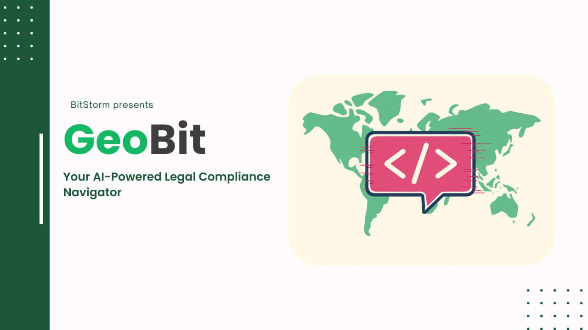
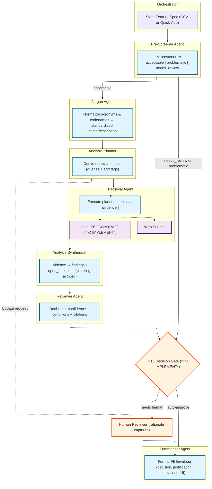

# GeoBit

[](https://python.org)
[](https://fastapi.tiangolo.com/)
[](https://openai.com)
[](https://nextjs.org/)
[](https://typescriptlang.org)
[](https://tailwindcss.com)
[](https://mongodb.com)
[](https://docker.com)
[](https://docs.astral.sh/uv/)
[](https://pnpm.io/)



**Ship features, not fines — AI that flags, explains, and logs geo-regulatory risk.**

## Table of Contents

- [Overview](#overview)
- [Features](#features)
- [Project Structure](#project-structure)
  - [Folder Structure](#folder-structure)
  - [Agentic AI Structure](#agentic-ai-structure)
- [Getting Started](#getting-started)
  - [Prerequisites](#prerequisites)
- [Backend Setup](#backend-setup)
  - [Create a Virtual Environment](#create-a-virtual-environment)
  - [Running backend with Script](#running-backend-with-script)
  - [Running backend with Docker](#running-backend-with-docker)
  - [Running with Uvicorn](#running-with-uvicorn)
- [Environment Variables](#environment-variables)
- [API Endpoints](#api-endpoints)
- [Development](#development)
- [Agent Pipeline Overview](#agent-pipeline-overview)
- [Contributors](#contributors)
- [License](#license)

## Overview <a id="overview"></a>

GeoBit transforms geo-compliance review from a product velocity bottleneck into an automated, audit-ready process. Our multi-agent AI system analyzes feature specifications and automatically flags geo-regulatory requirements, while providing clear reasoning and comprehensive audit trails.

**The Problem:** Legal compliance review is slow, inconsistent, and poorly documented. Product teams wait weeks for compliance decisions, and when audits come, there's no clear paper trail.

**Our Solution:** A multi-agent AI architecture that processes feature specifications, normalizes jargon, retrieves regulatory evidence, and delivers confident compliance decisions with full traceability.

## Features <a id="features"></a>

**Production-Ready Architecture**:

- **FastAPI** asynchronous backend with streaming endpoints
- **Singleton `agent_service`** initialized at application startup for optimal resource utilization
- **Stateful agent persistence** eliminates redundant initialization overhead
- **Dependency injection pattern** ensures consistent agent state across all API endpoints, as well as clean code practices
- **Lifespan management** with proper service initialization and cleanup lifecycle
- **Event-driven architecture** with comprehensive workflow state management

**Multi-Agent Pipeline**:

- Leverages multi-agent architecture with **OpenAI Agents SDK** integration for robust agent orchestration and tracing
- **Modular agent design** with clear separation of concerns and pluggable components

## Project Structure <a id="project-structure"></a>

### Folder Structure <a id="folder-structure"></a>

```sh
app/
  api/            # FastAPI routers and endpoints
  agent/          # All agent logic and agent-specific schemas
  core/           # Core config, environment, logging
  database/       # Database models and enums
  schemas/        # Global schemas for API and cross-agent use
  services/       # Service layer (agent orchestration, auth, etc.)
  config/         # Logging and app config
scripts/          # Startup and utility scripts
Dockerfile        # Docker build
README.md         # This file
```

### Agentic AI Structure <a id="agentic-ai-structure"></a>



## Getting Started <a id="getting-started"></a>

### Prerequisites <a id="prerequisites"></a>

- [Python 3.13 or higher](https://www.python.org/downloads/)
- [uv](https://docs.astral.sh/uv/getting-started/installation/) package and project manager

## Backend Setup <a id="backend-setup"></a>

### Create a Virtual Environment <a id="create-a-virtual-environment"></a>

This project uses `uv` as the Python package and project manager.

Create the venv:

```sh
uv venv
```

Activate the venv.

On macOS or Linux, run:

```sh
source .venv/bin/activate
```

On Windows, run:

```powershell
.venv/Scripts/activate
```

Install project dependencies:

```sh
uv sync
```

### Running backend with Script <a id="running-backend-with-script"></a>

On macOS or Linux, run:

```sh
./scripts/start.sh
```

On Windows, run:

```ps1
./scripts/start.ps1
```

### Running backend with Docker <a id="running-backend-with-docker"></a>

*NOTE: docker only runs for the backend, frontend has to be ran separately*

On macOS or Linux, run:

```sh
./scripts/start_docker.sh
```

On Windows, run:

```ps1
./scripts/start_docker.ps1
```

### Running with Uvicorn <a id="running-with-uvicorn"></a>

Run the following command to run the app with Uvicorn:

```sh
uvicorn app.main:app --host 127.0.0.1 --port 8000 --reload
```

## Environment Variables <a id="environment-variables"></a>

**Backend environemtn variables**: Copy `.env.example` to `.env` in the project root and fill in all required fields:

```env
OPENAI_API_KEY=your-key
SERPER_API_KEY=your-key
MONGODB_URI=your-mongodb-uri
MONGODB_DB_NAME=geobit

FRONTEND_HOST=http://localhost:3000
BACKEND_CORS_ORIGINS=http://localhost:8000
```

**Frontend environment variables** (create in `frontend/compliance-dashboard/.env.local`):

```env
NEXT_PUBLIC_API_BASE=http://localhost:8000

```

- Replace `your-key` with your actual API keys.
- These variables are required for both backend and frontend integration.
- Never commit your real `.env` file to version control.

## API Endpoints <a id="api-endpoints"></a>

| Endpoint | Method | Description |
|----------|--------|-------------|
| `/analyze/stream` | `POST` | Main streaming analysis endpoint that processes feature specifications through the multi-agent pipeline and returns real-time results in NDJSON format |
| `/agents` | `GET` | Retrieves a list of all available agents in the pipeline along with their configuration details and current status |

## Development <a id="development"></a>

- All agent logic is in `app/agent/` (each agent is modular and testable)
- Add new agents by extending the agent pipeline and schemas
- Workflow logic and agent orchestration will be handled in `AgentService` under `services/`
- Use the `scripts/` folder for Docker and local startup scripts

## Agent Pipeline Overview <a id="agent-pipeline-overview"></a>

1. **Pre-screen Agent**: Quickly filters out business-only or non-legal features.
2. **Jargon Agent**: Expands acronyms and internal terms, queries web if needed.
3. **Planner Agent**: Generates targeted retrieval needs for legal and compliance evidence.
4. **Retrieval Agent**: Searches internal KB and web for evidence
5. **Synthesizer Agent**: Synthesizes findings and open questions from evidence.
6. **Reviewer Agent**: Scores findings, applies deterministic rules, and flags for HITL if needed.
7. **Summariser Agent**: Formats the final result for frontend consumption.

Each agent is modular and can be extended or replaced independently. For more details, see the code in the `app/agent/` and `app/api/` folders, or open an issue for help!

## Contributors <a id="contributors"></a>

Built by BitStorm team for TikTok Techjam 2025!

<table>
  <tr>
    <td align="center">
      <a href="https://github.com/jdengoh">
        
        <br /><sub><b>@jdengoh</b></sub>
      </a>
    </td>
    <td align="center">
      <a href="https://github.com/ChickenChiang">
        
        <br /><sub><b>@ChickenChiang</b></sub>
      </a>
    </td>
    <td align="center">
      <a href="https://github.com/alvintjw">
        
        <br /><sub><b>@alvintjw</b></sub>
      </a>
    </td>
    <td align="center">
      <a href="https://github.com/ZuyuanChong">
        
        <br /><sub><b>@ZuyuanChong</b></sub>
      </a>
    </td>
  </tr>
</table>

## License

MIT
